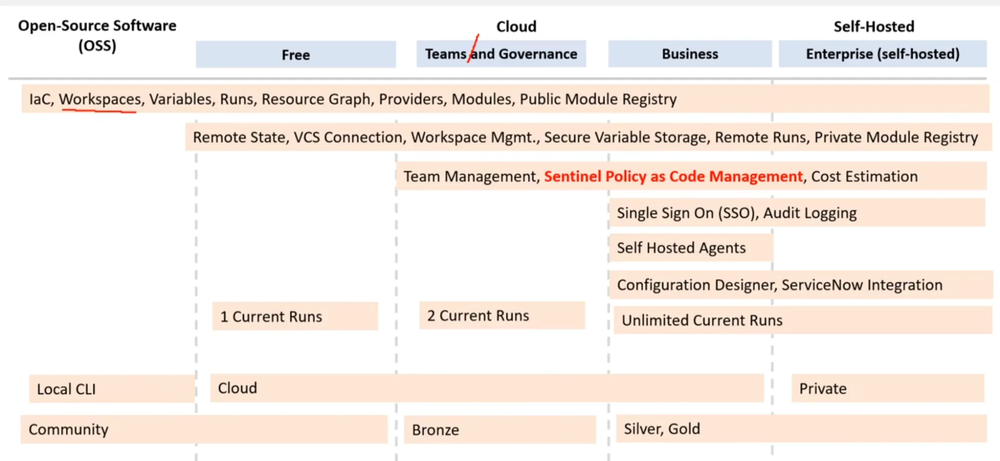
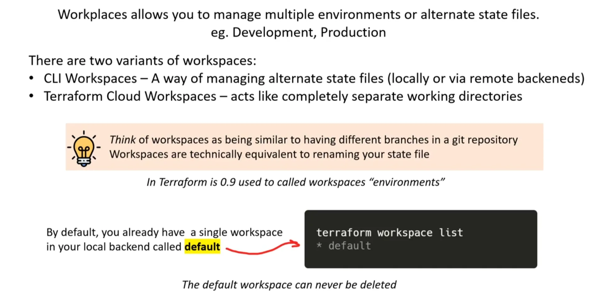

# Terraform Associate (003)

## **Infrastructure as Code (IaC) concepts**

**Problems with Manual Configuration**

- Prone to human errors, leading to misconfigurations.
- Difficult to manage and maintain compliance.
- Hard to transfer knowledge of configurations among team members.

**Infrastructure as Code (IaC) Benefits**

- Automates the process of creating, updating, and destroying infrastructure.
- Acts as a **blueprint** for infrastructure setup.
- Enables easy **sharing, versioning, and inventory** of infrastructure.

### **Declarative vs. Imperative Approaches in IaC**

### **Declarative Approach** (Explicit)

- Defines the desired end state of infrastructure.
- More verbose but avoids misconfiguration.
- Uses JSON, YAML, XML.
- **Examples:**
    
    
    - **ARM Templates** (Azure)
    - **Azure Blueprints** (Azure, manages relationships)
    - **CloudFormation** (AWS)
    - **Cloud Deployment Manager** (Google Cloud)
    - **Terraform** (Supports multiple cloud providers)
    
    
    

### **Imperative Approach** (Implicit)

- Specifies steps to achieve the desired state.
- Less verbose but prone to misconfiguration.
- More flexible than declarative.
- Uses Python, Ruby, JavaScript.
- **Examples:**
    
    
    - **AWS CDK** (AWS, includes built-in best practices)
    - **Pulumi** (Supports AWS, Azure, GCP, Kubernetes)
    
    
    

### **Infrastructure Lifecycle**

- Consists of **clearly defined work phases** used by DevOps engineers.
- Phases: **Plan, Design, Build, Test, Deliver, Maintain, and Retire** cloud infrastructure.

### **Day 0, Day 1, and Day 2** (Lifecycle Phases)

- **Day 0** → Planning and Design.
- **Day 1** → Development and Iteration.
- **Day 2** → Go Live and Maintenance.

**IaC enhances the infrastructure lifecycle by improving reliability, manageability, and sensibility.**

- **Reliability**
IaC ensures changes are idempotent, consistent, repeatable, and predictable.
- **Idempotent**
Running IaC multiple times results in the same expected state.
- **Manageability**
IaC enables code-based mutation and revisions with minimal changes.
- **Sensibility**
IaC helps avoid financial, reputational, and even life-threatening losses, especially in government and military infrastructure.


**Summary of Provisioning, Deployment, and Orchestration**

- Provisioning
    
    Definition: Preparing a server with systems, data, and software to make it ready for network operation.
    Tools: Achieved using Configuration Management tools like Puppet, Ansible, Chef, Bash scripts, PowerShell, or Cloud-Init.
    Cloud Context: Launching and configuring a cloud service is considered provisioning.
    
- Deployment
    
    Definition: Delivering a version of an application to a provisioned server.
    Tools: Deployment can be performed via tools like AWS CodePipeline, Harness, Jenkins, Github Actions, CircleCI.
    
- Orchestration
    
    Definition: Coordinating multiple systems or services.
    Context: A common term used when working with microservices, containers, and Kubernetes.
    Tools: Orchestration can be done using tools like Kubernetes, Salt, Fabric.
    

**How to Detect Configuration Drift**

Compliance Tools: Use tools like AWS Config, Azure Policies, or GCP Security Health Analytics to detect misconfigurations.
Built-in Drift Detection: Utilize built-in features like AWS CloudFormation Drift Detection.
State Storage: Store the expected state using tools like Terraform state files.

**How to Correct Configuration Drift**

Compliance Tools for Remediation: Use compliance tools like AWS Config to correct misconfigurations.
Terraform Refresh and Plan: Employ Terraform commands to refresh the state and plan corrections.
Manual Correction (Not Recommended): Avoid manually correcting configurations if possible.
Infrastructure Rebuild: As a last resort, tear down and set up the infrastructure again.

**How to Prevent Configuration Drift**

Immutable Infrastructure: Implement immutable infrastructure, using create-and-destroy strategies like Blue/Green deployments.

No Server Modification: Servers are never modified after deployment.

Image Baking: Utilize tools like AWS Image Builder, HashiCorp Packer, or GCP Cloud Run to bake AMIs or containers.

**GitOps** 

- **IaC and Git:** GitOps combines Infrastructure as Code (IaC) with a Git repository.
- **Formal Review Process:** It introduces a formal process for reviewing and approving changes to infrastructure code.
- **Automated Deployment:** Once the code is accepted (merged), it automatically triggers a deployment.

**GitOps Workflow** 


## Reference to Named Values

**Named Values** are **built-in expressions** to **reference various values** such as:

- **Resources**: `<Resource Type>.<Name>`
    
    e.g. `aws_instance.my_server`
    
- **Input variables**: `var.<Name>`
- **Local values**: `local.<Name>`
- **Child module outputs**: `module.<Name>`
- **Data sources**: `data.<Data Type>.<Name>`

---

**Filesystem and workspace info**:

- `path.module` – path of the module where the expression is placed
- `path.root` – path of the root module of the configuration
- `path.cwd` – path of the current working directory
- `terraform.workspace` – name of the currently selected workspace

---

**Block-local values** (within the body of blocks):

- `count.index` – (when you use the `count` meta argument)
- `each.key` / `each.value` – (when you use the `for_each` meta argument)
- `self.<attribute>` – self reference information within the block (e.g., provisioners and connections)

## Errors


## **Backends**

**Each Terraform configuration can specify a backend, which defines where and how operations are performed, where state snapshots are stored**

**Terraforms backends are divided into two types:**

### Standard backends

- only store state
- does not perform terraform operations eg. Terraform apply
    - To perform operations you use the CLI on your local machine
- **third-party backends** are Standard backends e.g. AWS S3

### Enhanced backends

- can both store state
- can perform terraform operations

Enhanced backends are subdivided further:

- **local** – files and data are stored on the local machine executing terraform commands
- **remote** – files and data are stored in the cloud eg. Terraform Cloud

## Terraform_Remote_State

### 🔄 `terraform_remote_state` data source

**Purpose**: Retrieves **root module output values** from **another Terraform configuration**, using the latest state snapshot.

---

### 📍 Remote Backend Example

```hcl
data "terraform_remote_state" "vpc" {
  backend = "remote"
  config = {
    organization = "hashicorp"
    workspaces = {
      name = "vpc-prod"
    }
  }
}

resource "aws_instance" "foo" {
  subnet_id = data.terraform_remote_state.vpc.outputs.subnet_id
}

```

### 💾 Local Backend Example

```hcl
data "terraform_remote_state" "vpc" {
  backend = "local"
  config = {
    path = "..."
  }
}

resource "aws_instance" "my_server" {
  subnet_id = data.terraform_remote_state.vpc.outputs.subnet_id
}

```

### Key Points

- Only **root-level outputs** from the remote state are accessible.
- **Nested module outputs** aren't directly available.
- To expose a nested output, **explicitly pass it through** in the root module:
    
    ```hcl
    module "app" {
      source = "..."
    }
    
    output "app_value" {
      value = module.app.example
    }
    
    ```
    

Alternate’s to custom 


Complex Types

Collection Types


Structural Types


## **Terraform Cloud Run Workflows**:

### 1. **UI/VCS Driven (User Interface and Version Control System)**

- Terraform Cloud is integrated with a specific branch in your VCS (e.g., GitHub) via webhooks.
- Pull requests generate speculative plans, and merges trigger runs on Terraform Cloud.

### 2. **API-Driven (Application Programming Interface)**

- Workspaces aren’t directly tied to a VCS; no webhooks are used.
- Third-party tools trigger runs by uploading a configuration file via the Terraform Cloud API.
- This file is a Bash script in a `.tar.gz` archive—known as a **Configuration Version**.

### 3. **CLI-Driven (Command Line Interface)**

- Runs are manually triggered using Terraform CLI commands (e.g., `terraform apply`, `terraform plan`) from the user’s local machine.

## Air Gap


## Cloud Feature and Pricing



Workspace



Sentinel

